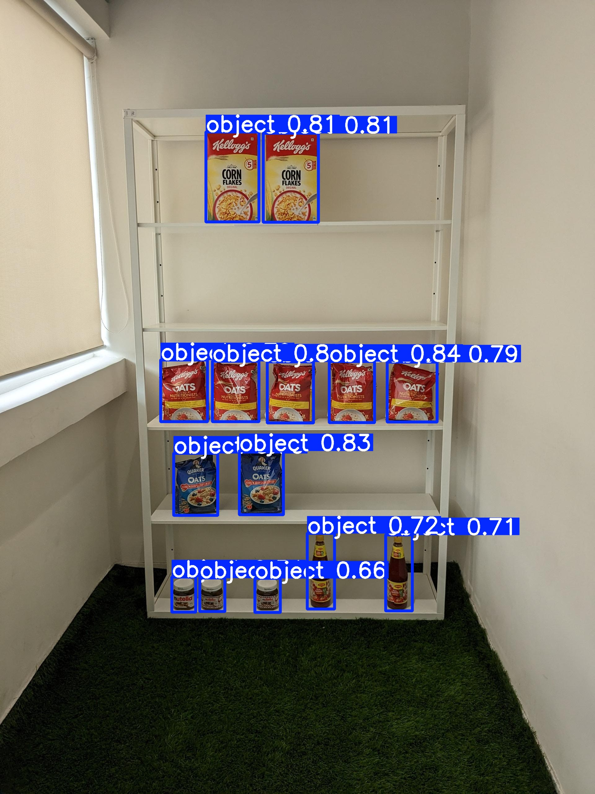
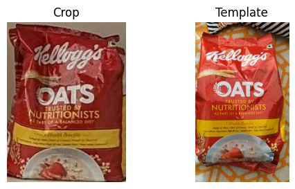
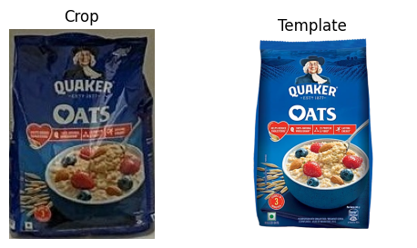
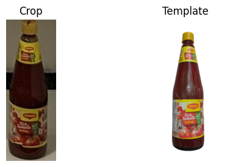
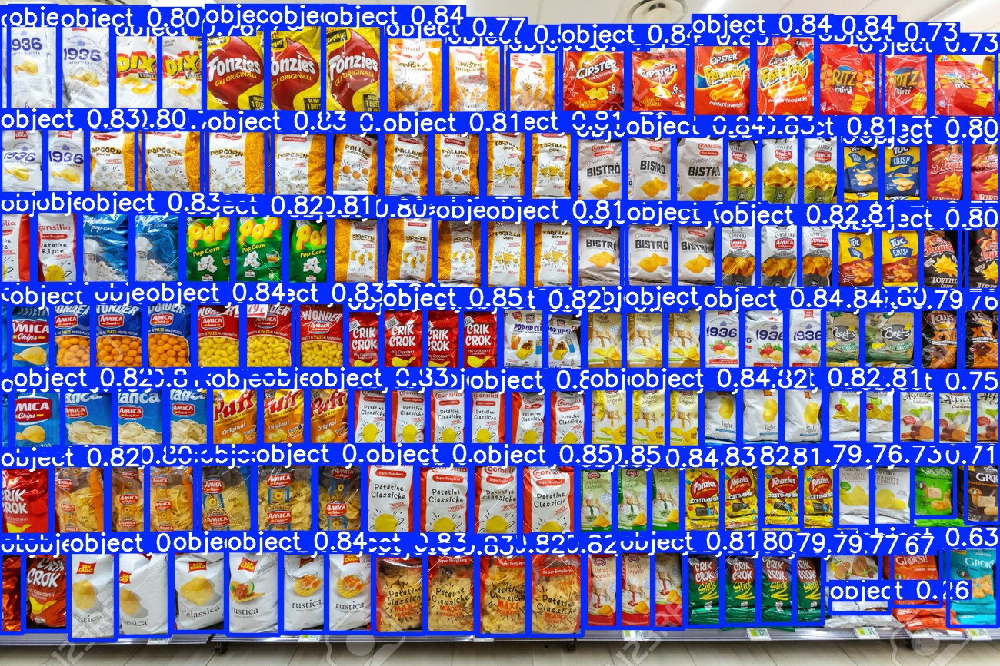
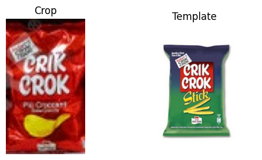
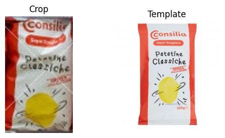
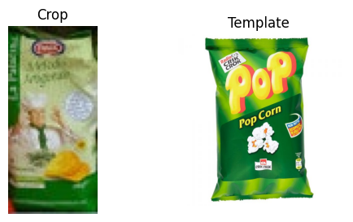

# supermarket-detection

Simple example project that uses YOLOv8 to identify and locate products on store shelves, and CLIP-based feature matching to associate detected items with reference images.

The following additional resources will be downloaded from my personal drive.
- Yolov8 model trained with the following dataset: [https://www.kaggle.com/datasets/thedatasith/sku110k-annotations](https://www.kaggle.com/datasets/thedatasith/sku110k-annotations)
- Test image 1 (smaller shelf) [source here](https://huggingface.co/datasets/bharadwajkg/planogram-sample-sd-data3/viewer/default/train?row=10&views%5B%5D=train)
- Target set 1 (set of product images that match the products from Test 1) [source: Google Images]
- Test image 2 (bigger shelf) [source here](https://www.dreamstime.com/rome-italy-december-several-packs-chips-snack-inside-ma-supermarket-italy-rome-shelves-full-tidy-shelves-image142747547)
- Target set 2 (set of product images that match the products from Test 2) [source: Google Images]

---

## Example Shelf 1 (Small simple case)

### Object detection with YOLO

### Some matches with target products
**Example 1:**  

**Example 2:**  

**Example 3:**  

## Example Shelf 2 (Bigger and more complex)

### Object detection with YOLO

### Some matches with target products
**Example 1:**  
Imperfect match. Found a similar object, but not the exact one.

**Example 2:**  
Good match.

**Example 3:**  
Incorrect match.

# Results and some conclusions
This notebook serves as a preliminary example and structural baseline for a future, more refined and accurate version. Two tests were conducted on different supermarket shelves.
- In the simpler case, both object detection and product matching produced solid results, consistent with the limited scope of this demonstration.
- On the larger and more complex shelf, object detection remained reliable, while the matching process achieved only moderate accuracy, correctly identifying some products but misclassifying others, partly due to the lower quality and variability of the input image.

